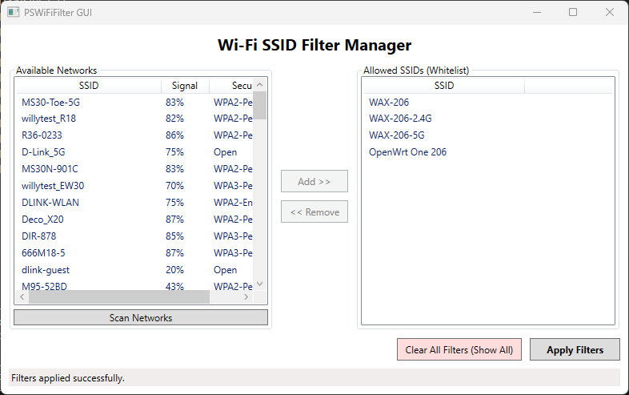

# WiFiFilterGUI

這是一個用於管理 Windows Wi-Fi SSID 可見性的圖形化介面工具。它是 `PSWiFiFilter` PowerShell 腳本的 C# WPF 版本。



## 功能

*   **掃描網路**：列出所有可用的 Wi-Fi 網路。
*   **白名單管理**：允許使用者選擇想看到的特定網路（加入白名單）。
*   **應用過濾器**：隱藏白名單以外的所有網路。
*   **清除過濾器**：移除所有過濾設定，恢復顯示所有網路。
*   **自動儲存**：自動將白名單儲存至 `allowed_ssids.txt`，下次開啟時自動載入。

## 系統需求

*   Windows 10 或 Windows 11
*   .NET 8.0 SDK 或 Runtime
*   **管理員權限**（執行 `netsh` 指令所需）

## 如何編譯

1.  確保已安裝 .NET 8.0 SDK。
2.  開啟終端機（PowerShell 或 CMD）。
3.  切換到專案目錄：
    ```powershell
    cd c:\PSWiFiFilter\WiFiFilterGUI
    ```
4.  執行建置指令：
    ```powershell
    dotnet build
    ```

## 如何執行

### 方法一：透過 dotnet CLI
在專案目錄下執行：
```powershell
dotnet run
```
*注意：程式會自動請求提升至管理員權限。*

### 方法二：執行編譯後的執行檔
1.  前往輸出目錄，通常在 `bin\Debug\net8.0-windows` 或 `bin\Release\net8.0-windows`。
2.  右鍵點擊 `WiFiFilterGUI.exe`。
3.  選擇「以系統管理員身分執行」。

## 如何測試

由於此工具會修改系統的 Wi-Fi 過濾器設定，建議依照以下步驟進行測試：

1.  **啟動程式**：確認程式成功開啟，並顯示「Available Networks」列表。
2.  **選擇網路**：從左側列表中選擇您的 Wi-Fi 網路，點擊 `Add >>` 加入右側白名單。
3.  **應用過濾**：點擊 `Apply Filters`。
    *   **驗證**：點擊 Windows 工作列右下角的 Wi-Fi 圖示，確認列表中**只剩下**您剛剛加入白名單的網路。
4.  **清除過濾**：點擊程式中的 `Clear All Filters (Show All)`。
    *   **驗證**：再次檢查 Windows Wi-Fi 列表，確認所有附近的網路都已恢復顯示。
5.  **測試儲存功能**：
    *   加入幾個網路到白名單。
    *   關閉程式。
    *   重新開啟程式。
    *   **驗證**：確認右側白名單中仍然保留著上次加入的網路。

## 注意事項

*   此工具依賴 Windows 的 `netsh wlan` 指令。
*   如果遇到權限錯誤，請確保以管理員身分執行程式。
